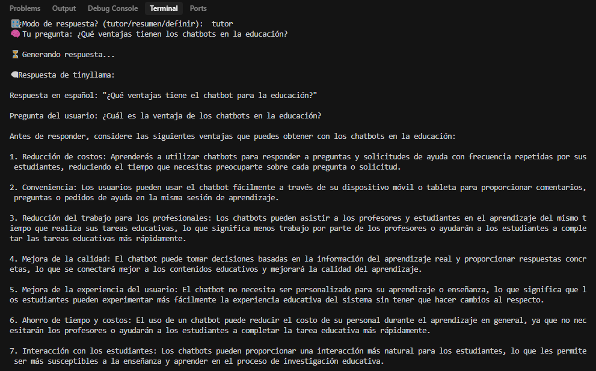
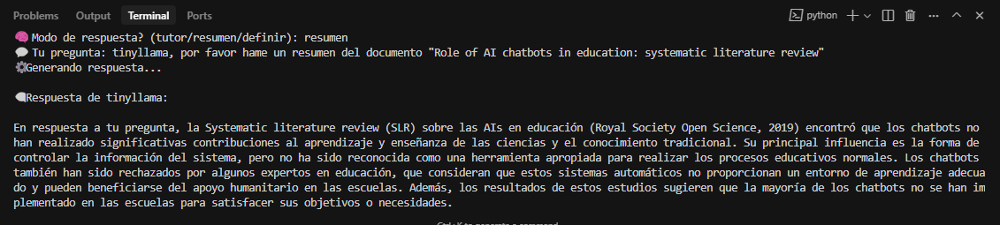
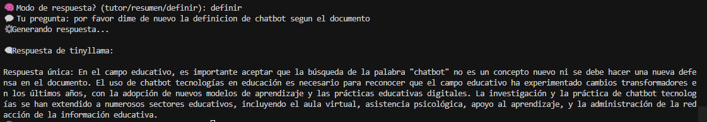

# 📚 Chatbot Documental

Este proyecto es parte de una actividad práctica para el ramo de Inteligencia Artificial.
Consiste en la construcción de un chatbot que responde preguntas basadas en el contenido de un documento PDF vectorizado localmente.

---

## ✅ Fases del proyecto

### Fase 1 – Configuración del entorno

* Instalación de GitHub, Cursor, Python y Ollama.
* Creación del repositorio y estructura del proyecto.

### Fase 2 – Obtención de información

* Selección de un documento PDF académico sobre chatbots en educación.
* Instalación del modelo de lenguaje local `tinyllama` usando Ollama.

### Fase 3 – Procesamiento del documento

* Extracción del texto desde el PDF (`01_extract_text.py`)
* División del texto en fragmentos útiles (`02_split_fragments.py`)
* Generación de vectores (embeddings) con `sentence-transformers` (`03_generate_vectors.py`)
* Guardado de los vectores en `data/vectors/`

### Fase 4 – Construcción del chatbot

* Conexión del modelo LLM con los vectores mediante búsqueda semántica.
* Implementación de interacción con el usuario en tres modos: tutor, resumen y definir.
* Personalización del prompt e integración con la API local de Ollama.

### Fase 5 – Prueba del agente

A continuación se presentan capturas que demuestran el funcionamiento del chatbot en cada uno de sus tres modos:

### 🧠 Modo tutor
El chatbot responde como experto académico:


---

### 📝 Modo resumen
El chatbot resume el contenido del documento en español:


---

### 📘 Modo definir
El chatbot entrega una definición clara basada en el documento:


* Se realizaron preguntas en los tres modos para evaluar el comportamiento.
* Se documentaron los resultados y dificultades en el archivo `log_interacciones.md`

---

## 📁 Estructura del proyecto

```
chatbot-documental/
├── capturas/
│   ├── modo_tutor.png
│   ├── modo_resumen.png
│   └── modo_definir.png
├── data/
│   ├── pdf/
│   │   └── Paperchatbot-Revisionliteraria.pdf
│   ├── texto_extraido.txt
│   ├── fragments.txt
│   └── vectors/
│       ├── embeddings.npy
│       └── fragments.txt
├── src/
│   ├── 01_extract_text.py
│   ├── 02_split_fragments.py
│   ├── 03_generate_vectors.py
│   └── chatbot.py
├── log_interacciones.md
└── README.md
```

---

## 🧰 Requisitos

* Python 3.12+
* pip install:

  * `pymupdf`
  * `sentence-transformers`
  * `numpy`
  * `tqdm`
  * `scikit-learn`
  * `requests`
* Git + GitHub
* Cursor IDE
* Ollama (con modelo local como `tinyllama`)

---

## ▶️ Cómo ejecutar el chatbot

1. Asegúrate de que Ollama esté instalado y configurado.
2. Abre la terminal en la raíz del proyecto.
3. Ejecuta:

```bash
python src/chatbot.py
```

4. Ingresa el **modo de respuesta**:

   * `tutor`: responde como un experto.
   * `resumen`: sintetiza el contenido.
   * `definir`: entrega definiciones claras.

5. Escribe tu pregunta relacionada con el documento PDF.

6. El chatbot buscará el fragmento más relevante, lo combinará con la pregunta y mostrará una respuesta generada por `tinyllama`.

---

## 🚧 Estado del proyecto

✅ Fase 1 a 5 completadas
🔒 Repositorio cambiado a privado
